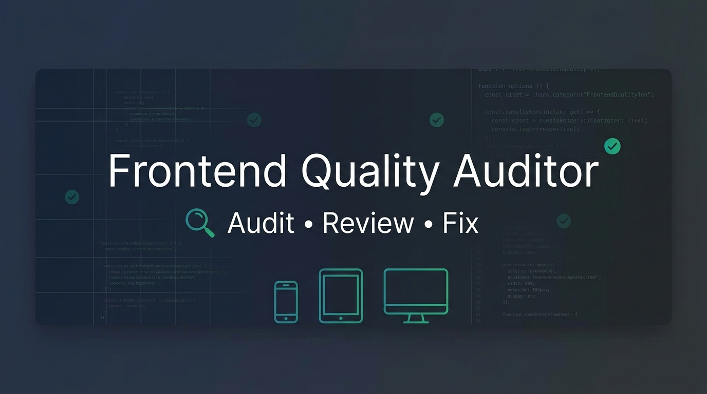

<p align="center">
  
</p>

# Frontend Quality Auditor

A CLI tool and AI agent skill that audits your frontend projects — finds dead code, unused deps, accessibility issues, and responsive layout bugs. Then it generates a clear report and can auto-fix the safe stuff.

Built this because I got tired of shipping code with leftover `console.log` statements, 3MB hero images, and packages sitting in `package.json` that nobody actually imports. This tool catches all of that.

---

## Install

### As an AI Agent Skill

Clone it into your agent's skills folder:

```bash
# Gemini / Antigravity
git clone https://github.com/abdelrhmanahmed255/Frontend-Quality.git ~/.gemini/skills/frontend-quality-auditor

# Claude Code
git clone https://github.com/abdelrhmanahmed255/Frontend-Quality.git ~/.claude/skills/frontend-quality-auditor

# Cursor
git clone https://github.com/abdelrhmanahmed255/Frontend-Quality.git ~/.cursor/skills/frontend-quality-auditor
```

Then just tell your agent something like:
> "Audit my project for code quality and responsive issues"

### As a CLI

```bash
# run directly without installing
npx frontend-quality-auditor audit .

# or install globally
npm install -g frontend-quality-auditor
```

---

## Usage

```bash
# Full audit — prints to terminal + saves a markdown report
frontend-auditor audit

# Same audit but on a specific directory
frontend-auditor audit ./my-app

# Get suggestions without touching any files
frontend-auditor suggest

# Auto-fix safe issues (removes console.log, debugger, etc.)
frontend-auditor fix --safe
```

The audit generates a markdown report at `audit-reports/FRONTEND_AUDIT_REPORT.md` with severity ratings, quick wins, and file-level evidence.

---

## What It Checks

| Category | What it looks for |
|---|---|
| **Code Quality** | `console.log`, `debugger`, hardcoded `localhost` URLs, empty click handlers, monster components (300+ lines) |
| **Imports** | Unused imports that are imported but never referenced in the file |
| **Dependencies** | Packages in `package.json` that are never imported anywhere in your code |
| **Assets** | Images over 500KB, old formats (PNG/JPG) that should be WebP/AVIF, unreferenced files |
| **Responsive** | Horizontal scroll overflow, broken grids, elements bleeding outside viewport |
| **Accessibility** | Missing `alt` tags, small touch targets (<44px), broken heading hierarchy |

Every finding gets a severity level:
- **P0** — breaks the page, fix now
- **P1** — major problem, fix before shipping
- **P2** — noticeable issue, fix when you can
- **P3** — minor cleanup, nice to have

---

## Config

Drop a `config/auditor.config.json` in your project root to customize thresholds:

```json
{
  "rules": {
    "maxAssetSizeKB": 500,
    "maxComponentLines": 300,
    "disallowConsole": true,
    "checkUnusedImports": true,
    "checkUnusedDeps": true
  },
  "fixes": {
    "safeOnly": true
  }
}
```

If no config file exists, it uses sensible defaults.

---

## Supported Frameworks

Auto-detects your setup:
- Next.js (App Router & Pages Router)
- React + Vite / CRA
- Remix
- Static HTML/CSS
- Tailwind CSS
- TypeScript

---

## Project Structure

```
Frontend-Quality/
├── bin/
│   └── auditor.mjs              # CLI entrypoint
├── config/
│   └── auditor.config.json      # Default configuration
├── rules/                       # Reference docs for each audit category
│   ├── accessibility.md
│   ├── assets.md
│   ├── code-quality.md
│   ├── dependencies.md
│   ├── performance.md
│   ├── responsive.md
│   └── ux.md
├── src/
│   ├── index.mjs                # Main orchestrator
│   ├── config-loader.mjs        # Reads and merges config
│   ├── analyzers/
│   │   ├── project-detector.mjs # Detects framework, TS, Tailwind
│   │   ├── route-discovery.mjs  # Finds all routes
│   │   ├── import-analyzer.mjs  # Unused import detection
│   │   ├── dependency-analyzer.mjs
│   │   ├── asset-analyzer.mjs
│   │   ├── code-analyzer.mjs    # console.log, debugger, etc.
│   │   └── browser-analyzer.mjs # DOM checks for Playwright
│   ├── reporters/
│   │   ├── terminal.mjs
│   │   ├── markdown.mjs
│   │   └── json.mjs
│   └── fixes/
│       ├── safe-fixes.mjs       # Auto-removes console.log, debugger
│       └── approval-required.mjs
├── assets/
│   └── banner.jpg
├── SKILL.md                     # Agent skill specification
├── package.json
├── LICENSE
└── README.md
```

---

## Contributing

Got a bug or feature idea? Open an issue first so we can talk about it, then submit a PR. Keep it simple.

---

## License

MIT © [Abdelrhman Ahmed](https://github.com/abdelrhmanahmed255)